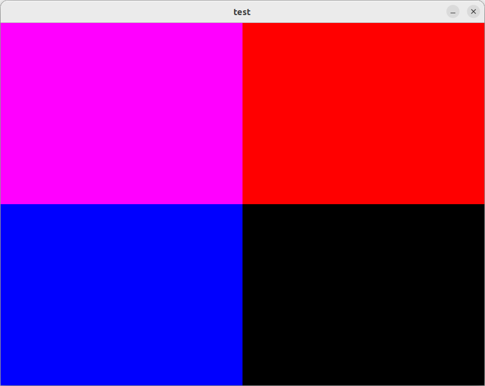

# TorchWindow

TorchWindow is a Python library that enables viewing of PyTorch Cuda Tensors on screen directly from GPU memory (No copying back and forth between GPU and CPU) via OpenGL-Cuda interop.

## Install

```
pip install torchwindow
```

## Use
To create a window
```
from torchwindow import Window
window = Window(640, 480, name="Torch Window")
```
To display an image tensor in the window
```
window.draw(image)
```
`image` must be a tensor with the following properties:
- 3 dimensions, specifically `(rows, columns, channels)` in that order.
- `channels` dimension must be of size 4 (r, g, b, a)

## Example
To check if torchwindow is properly installed try running
```
python3 -m torchwindow.example
```
You should see this window appear for 5 seconds before closing
